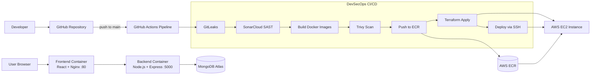
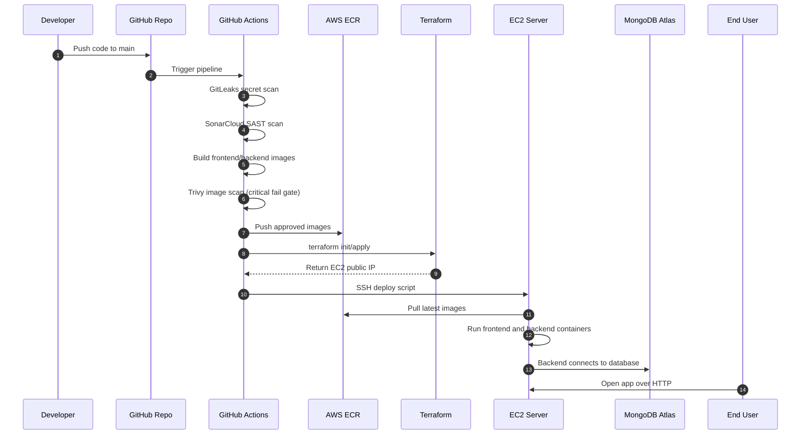

# MERN DevSecOps Practice Project

This repository demonstrates a full DevOps + DevSecOps workflow for a MERN task board application.

It covers:
- Local development (frontend + backend)
- Containerization with Docker
- Security scanning in CI
- Infrastructure provisioning with Terraform
- Automated deployment to AWS EC2 from GitHub Actions

## 1. Application Overview

Stack:
- Frontend: React + Vite
- Backend: Node.js + Express + Mongoose
- Database: MongoDB Atlas
- Runtime on server: Docker containers
- CI/CD: GitHub Actions
- Cloud: AWS (ECR + EC2)
- IaC: Terraform

The app is a simple task board with APIs to:
- list tasks
- create tasks
- toggle task status

### 1.1 Architecture Diagram (Mermaid)



## 2. DevOps Components Used

### 2.1 Docker

Backend image:
- File: backend/Dockerfile
- Uses node:20-alpine3.22
- Installs dependencies and runs npm start on port 5000

Frontend image:
- File: frontend/Dockerfile
- Multi-stage build
- Stage 1 builds static assets using Vite
- Stage 2 serves assets through Nginx on port 80

Why used:
- Consistent runtime across local, CI, and EC2
- Easy image publishing to ECR

### 2.2 CI/CD (GitHub Actions)

Pipeline file:
- .github/workflows/devsecops-pipeline.yml

Trigger:
- push to main branch

Main result:
- Code is scanned, images are built and scanned, infra is provisioned, and deployment runs automatically

### 2.3 Infrastructure as Code (Terraform)

Terraform files:
- terraform/provider.tf
- terraform/variables.tf
- terraform/main.tf

Resources created:
- AWS security group (ports 22, 80, 5000)
- EC2 instance (t3.micro)
- Dynamic Ubuntu 22.04 AMI lookup
- User data script to install and enable Docker on first boot
- Output: server_public_ip

Why used:
- Reproducible infrastructure
- No manual server provisioning steps

### 2.4 AWS ECR + EC2

ECR:
- Stores versioned backend and frontend container images

EC2:
- Pulls latest images from ECR
- Runs containers:
	- mern-backend on 5000
	- mern-frontend on 80

Why used:
- Clear separation between build system and runtime host

## 3. DevSecOps Controls Used

### 3.1 Secret Scanning (GitLeaks)

- Job: gitleaks_scan
- Action: gitleaks/gitleaks-action@v2

Purpose:
- Detect committed secrets before deployment continues

### 3.2 SAST and Code Quality (SonarCloud)

- Job: sonar_scan
- Action: SonarSource/sonarqube-scan-action@master
- Sources scanned: frontend/src and backend/src

Purpose:
- Detect code quality issues and static vulnerabilities early

### 3.3 Container Vulnerability Scanning (Trivy)

- Job: build_scan_push
- Action: aquasecurity/trivy-action@master
- Scans both backend and frontend images
- severity: CRITICAL
- exit-code: 1 (pipeline fails on critical findings)

Purpose:
- Block deployment if critical image vulnerabilities are found

### 3.4 Fail-Fast Deployment Behavior

- Remote deploy script uses set -e
- Any failed command stops deployment immediately

Purpose:
- Prevent partial or inconsistent deployments

## 4. End-to-End Pipeline Flow

When code is pushed to main:

1. gitleaks_scan
- Checks repository for leaked secrets.

2. sonar_scan
- Runs SonarCloud analysis after secret scan passes.

3. build_scan_push
- Logs in to AWS
- Ensures ECR repositories exist (mern-backend, mern-frontend)
- Builds Docker images
- Runs Trivy scan for each image
- Pushes images to ECR

4. terraform_deploy
- Runs terraform init and terraform apply inside terraform directory
- Reads EC2 public IP from Terraform output
- Passes IP to next job

5. deploy_to_ec2
- Waits for EC2 boot and Docker readiness
- Gets ECR login password
- SSH to EC2
- Stops/removes old containers
- Pulls latest images from ECR
- Runs new containers
- Prunes old dangling images

### 4.1 End-to-End Flow Diagram (Mermaid)



## 5. Project Structure

Top-level folders:
- frontend: React application
- backend: Express API
- terraform: AWS infrastructure definitions
- .github/workflows: CI/CD pipeline definitions

## 6. Prerequisites

For local development:
- Node.js 18+
- npm
- MongoDB Atlas cluster

For cloud deployment via pipeline:
- AWS account
- ECR access
- EC2 key pair
- GitHub repository secrets configured
- SonarCloud project and token

## 7. Environment Variables

### 7.1 Backend (backend/.env)

Required:
- PORT=5000
- MONGODB_URI=<atlas-connection-string>
- MONGODB_DB_NAME=mern_devops_practice
- FRONTEND_URL=http://localhost:5173

Notes:
- In CI deploy, MONGODB_URI is passed to the backend container.
- If MONGODB_DB_NAME is not passed in container runtime, MongoDB uses DB defaults from URI/driver behavior.

### 7.2 Frontend (frontend/.env)

Required:
- VITE_API_URL=http://localhost:5000/api

## 8. Local Development

Install dependencies from repository root:

```bash
npm install
npm install --prefix backend
npm install --prefix frontend
```

Run both apps concurrently:

```bash
npm run dev
```

Run apps separately:

```bash
npm run dev --prefix backend
npm run dev --prefix frontend
```

Useful URLs:
- Frontend: http://localhost:5173
- Backend health: http://localhost:5000/api/health

## 9. API Endpoints

- GET /api/health
- GET /api/tasks
- POST /api/tasks
- PATCH /api/tasks/:id/toggle

Example payload for POST /api/tasks:

```json
{
	"title": "Write DevSecOps README"
}
```

## 10. GitHub Secrets Required

Configure these repository secrets for CI/CD:
- GITHUB_TOKEN (provided automatically by GitHub in workflow context)
- SONAR_TOKEN
- AWS_ACCESS_KEY_ID
- AWS_SECRET_ACCESS_KEY
- AWS_REGION
- AWS_ACCOUNT_ID
- EC2_SSH_KEY
- MONGODB_URI

## 11. Security and Operations Summary

This project applies DevSecOps in layers:
- Pre-build layer: GitLeaks and SonarCloud
- Image layer: Trivy scan with fail on critical
- Infra layer: Terraform-managed resources
- Runtime layer: immutable container redeploy on EC2

Operationally, this means:
- deployment is automated
- infra is version-controlled
- security gates block unsafe changes
- runtime update is repeatable and fast

## 12. Troubleshooting

Common CI/CD issues and checks:

1. Sonar scan fails
- Verify SONAR_TOKEN and Sonar project/org key settings.

2. ECR push fails
- Verify AWS credentials, region, and account permissions.

3. Terraform apply fails
- Verify key_name in terraform/variables.tf matches an existing EC2 key pair in target region.

4. SSH deploy fails
- Verify EC2_SSH_KEY format and that security group allows port 22.

5. Backend container cannot connect to DB
- Verify MONGODB_URI secret and Atlas network access rules.

## 13. Future Improvements

- Pin all GitHub Actions to immutable commit SHAs
- Add dependency and license scanning (for example, SCA)
- Add unit/integration tests and test stage before image build
- Add HTTPS termination and reverse proxy hardening
- Add blue-green or rolling deployment strategy
